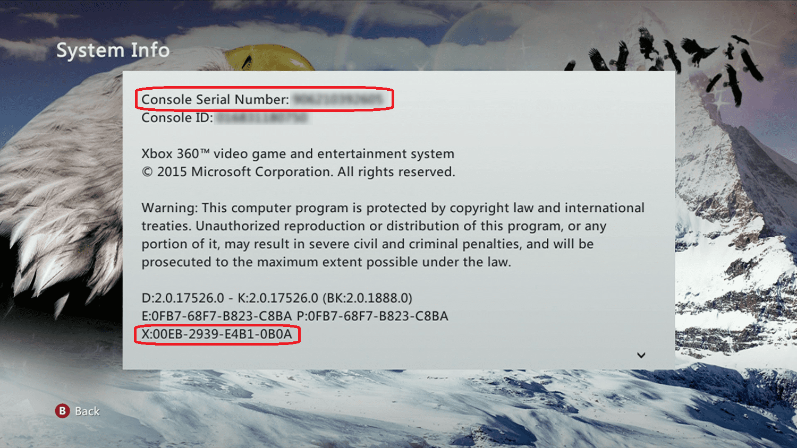

# xval-decrypt-web

Hosted at https://github.com/mitchellwaite/xval-decrypt-web

Simple web app to decrypt Xbox 360 XVal data, and can be used to determine if any security events have been logged to the Xbox 360's flash memory. Logged events indicate a security violation of some sort and might be an indication of a future console ban. Xval also indicates whether the console is currently banned.

The X value and console serial number can be found under System Settings > Console Settings > System Info.

Only CryptoJS is used here (because DES...) so there's minimal bloat.

Based on the python script originally written by Redline99.

- Originally posted at XboxHacker: http://www.xboxhacker.org/index.php?topic=16401.0
- Gist: https://gist.github.com/landaire/2669789
